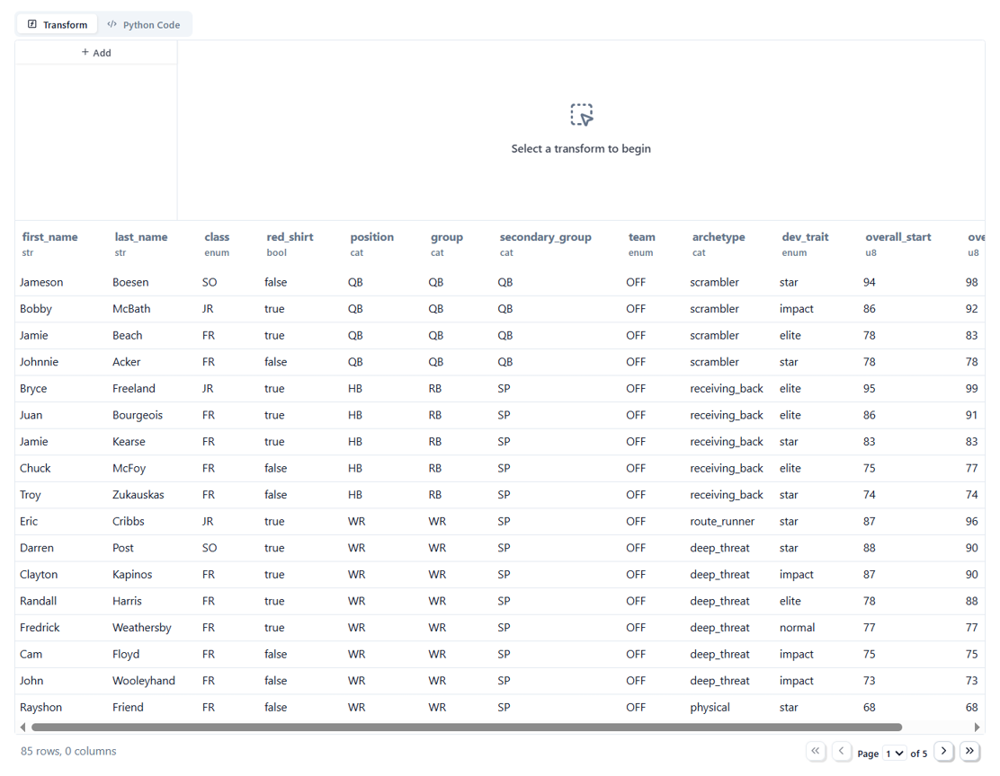
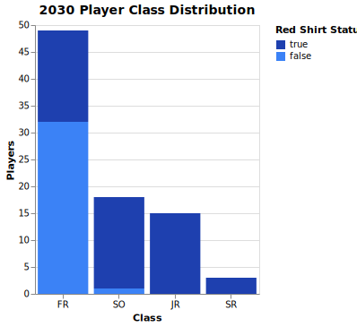
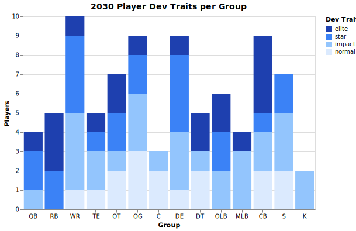
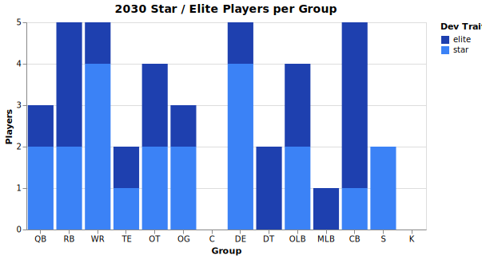
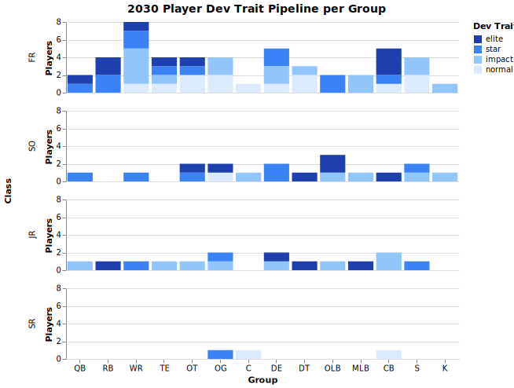
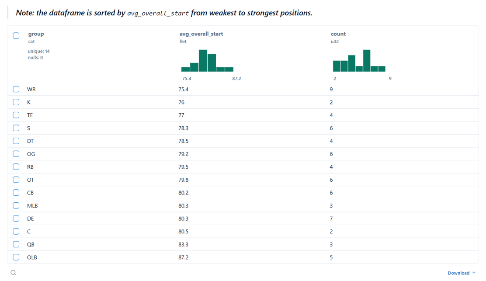
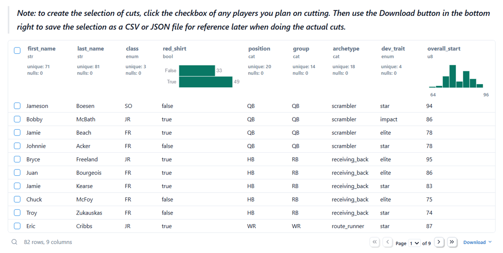

# **College Football Video Game Roster Analysis**

## **Overview of Project**
The following project analyzes three college football rosters managed
individually by three human users (myself and two friends) within the dynasty
mode of a video game called EA Sports College Football 25 (CFB 25). The goal of
the project was to create a tool that helps make the recruiting portion of the
game easier by collecting data from different screens within the mode and
displaying it in a readily accessible and consistent format.

The result of this effort is an app that allows a user to view a given roster,
transform the roster into alternate views, see visualizations related to roster
construction, and use pre-transformed views to assess possible players leaving
to the NFL draft and young player quality. An additional section allows the user
to build a players-to-cut list that can be saved for reference later when roster
cuts are performed.

### **Tools Used**
The project uses the `marimo` notebook framework for all of the analysis,
interactive UI elements, and for transformation of the notebook into a web app.
The `polars` library is used for loading the roster data and performing
dataframe transformations. `altair` is used for the visualizations.

For the deployed app, `httpx` is used to fetch the roster files from the repo,
replacing the file system read operations that are done when the notebook is run
locally. The app is deployed on GitHub Pages: [CFB 25 Roster Analysis
App](https://cdpeters.github.io/cfb-analysis/).

### **Roster Data**
The roster data is collected manually and contained within three separate Excel
files, one for each of the three universities analyzed. Each sheet within the
file contains the roster for a given season (indicated by the sheet name). The
Excel files are located in the
[`data/datasets/`](https://github.com/cdpeters/cfb-analysis/tree/main/data/datasets)
folder of the repo.

### **Notebooks**
The relevant `marimo` notebooks can be found in the
[`notebooks/`](https://github.com/cdpeters/cfb-analysis/tree/main/notebooks)
folder of the repo. The primary analysis notebook that the web app is also
derived from is
[`roster_analysis.py`](https://github.com/cdpeters/cfb-analysis/blob/main/notebooks/roster_analysis.py).
There is an additional analysis notebook,
[`roster_comparison.py`](https://github.com/cdpeters/cfb-analysis/blob/main/notebooks/roster_comparison.py),
that aims to compare the three rosters of a given season directly but is
currently a work in progress. Lastly, the notebook
[`players_leaving.py`](https://github.com/cdpeters/cfb-analysis/blob/main/notebooks/players_leaving.py)
is for updating the roster files with a new sheet for the next season with the
seniors removed and the class standing for each player advanced by one year
(freshman to sophomore, sophomore to junior, etc.). `utilities.py` is a
supporting file for `players_leaving.py`.

### **Additional Visualizations**
When `roster_analysis.py` is run locally, the visualizations that get created
for a specific university and season get saved in the
[`data/images/`](https://github.com/cdpeters/cfb-analysis/tree/main/data/images)
folder in the repo. There are also some images from `roster_comparison.py`
located in the same folder.

### **Run the Project Locally**
The project can be run locally via the following instructions. These
instructions assume the usage of the package manager `uv`.

1. Clone the [cfb-analysis](https://github.com/cdpeters/cfb-analysis) repo.
1. Create the project's environment using the `uv.lock` file by moving to
   `cfb-analysis/` and running:
    ```bash
    uv sync
    ```
1. Activate the environment:
    ```bash
    source .venv/Scripts/activate
    ```
1. Within `cfb-analysis/notebooks/` find `roster_analysis.py` and open it in a
   text editor.
1. In line 4, where `app` is assigned, change the `html_head_file` argument to
   an empty string. The assignment should now look like this:
    ```python
    app = marimo.App(
        width="medium",
        css_file="",
        html_head_file="",
    )
    ```
    This change has to be made because there is an issue with running the
    notebook locally and sourcing the same HTML head that is used in the
    deployed version of the app.
1. From within `notebooks/`, run the notebook in edit mode:
    ```bash
    marimo edit roster_analysis.py
    ```

## **Analysis**
Analysis is performed on the selected university's roster for the selected
season. The following sections detail the purpose and some of the implementation
of each analysis within the app. The images below serve as examples of views
within the app with `Fresno State` and `2030` selected as the university and
season inputs respectively.

### **Roster Viewer**
The roster viewer is a general tool that allows for creating many different
views of the roster as needed. The idea is for the user to use the viewer for
arbitrary queries that they're interested in that are not covered in the
sections following this one. The viewer itself is a `marimo.ui.dataframe` UI
element that comes with all the transformation capabilities built-in.

The following image shows an example of the roster viewer UI element:

<div align="center">
    
</div>

Users can add/delete transformations at any time and even see the resulting
python code that achieves those transformations. As mentioned in the overview,
some of the transformations include:
- filtering
- selecting, renaming, converting, sorting, or exploding columns
- grouping
- aggregating
- sampling rows

### **Player Class Distribution**


<div align="center">
    
</div>


### **Development Traits per Position/Group**


<div align="center">
    
</div>


<div align="center">
    
</div>


<div align="center">
    
</div>


### **Potential Non-Senior Drafted Players**


<div align="center">
    
</div>


### **Young Player Quality**


<div align="center">
    
</div>


### **Players to Cut**


<div align="center">
    
</div>


## **Future Plans**
The current version of the project focuses on analysis of one roster at a given
time. This is due to the goal of creating a roster construction aid. Future work
will aim to add analyses that focus on comparing all three of the rosters
simultaneously.
