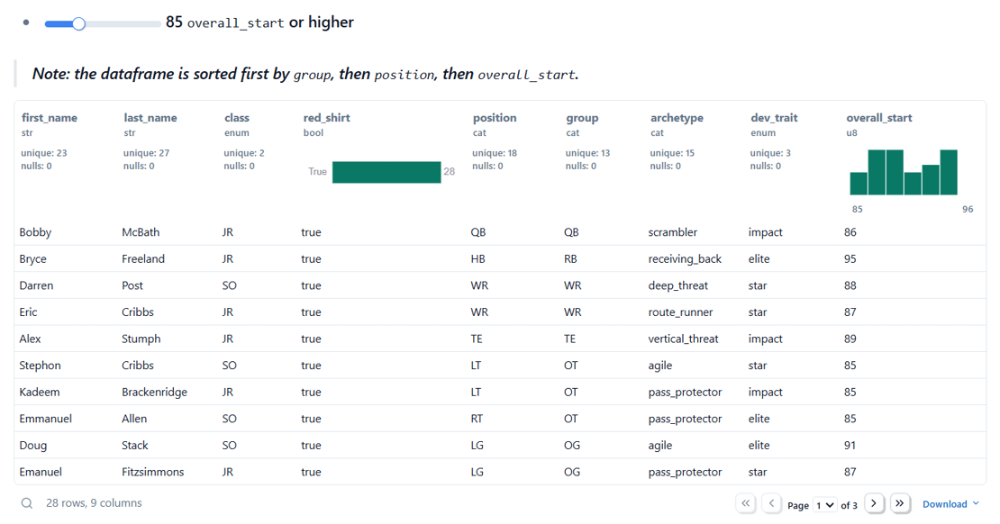

# **College Football Video Game Roster Analysis**

## **Overview of Project**
The following project analyzes three college football rosters managed
individually by three human users (myself and two friends) within the dynasty
mode of a video game called EA Sports College Football 25 (CFB 25). The dynasty
mode allows for users to play multiple seasons while also participating in
roster building through the recruiting process. The goal of the project was to
create a tool that helps make the recruiting portion of the game easier by
collecting data from different screens within the mode for display in a readily
accessible and consistent format.

The result of this effort is an app that allows a user to view a given roster,
transform the roster into alternate views, see visualizations related to roster
construction, and use pre-transformed views to assess possible players leaving
to the NFL draft and young player quality. An additional section allows the user
to build a players-to-cut list that can be saved for reference later when roster
cuts are performed.

### **Tools Used**
The project uses the following tools:
- `marimo`: notebook framework, interactive UI elements, transformation to web
app capability
- `polars`: load and transform data
- `altair`: visualizations
- `httpx`: fetch roster files from the git repo for the web app version

The app is deployed on GitHub Pages: [CFB 25 Roster Analysis
App](https://cdpeters.github.io/cfb-analysis/).

### **Roster Data**
Roster data is collected manually and contained within three separate Excel
files, one for each of the three universities analyzed:
- sheet names indicate season
- the dynasty mode starts in the 2024 season but data was only collected for the
2029 and 2030 seasons
- roster files are located in the
[`data/datasets/`](https://github.com/cdpeters/cfb-analysis/tree/main/data/datasets)
folder.

### **Notebooks**
The relevant `marimo` notebooks can be found in the
[`notebooks/`](https://github.com/cdpeters/cfb-analysis/tree/main/notebooks)
folder. The notebooks are:
- [`roster_analysis.py`](https://github.com/cdpeters/cfb-analysis/blob/main/notebooks/roster_analysis.py):
the primary analysis notebook that the web app is derived from
- [`roster_comparison.py`](https://github.com/cdpeters/cfb-analysis/blob/main/notebooks/roster_comparison.py):
compares the three rosters of a given season directly (currently a work
in progress)
- [`players_leaving.py`](https://github.com/cdpeters/cfb-analysis/blob/main/notebooks/players_leaving.py):
updates the roster files with a new sheet for the next season with seniors
removed and class standing for each player advanced by one year (freshman to
sophomore, sophomore to junior, etc.)
- [`utilities.py`](https://github.com/cdpeters/cfb-analysis/blob/main/notebooks/utilities.py):
a supporting file for `players_leaving.py`.

### **Additional Visualizations**
When `roster_analysis.py` is run locally, the visualizations that get created
for a specific university and season get saved in the
[`data/images/`](https://github.com/cdpeters/cfb-analysis/tree/main/data/images)
folder. There are also some images from `roster_comparison.py` located in the
same folder.

### **Run the Project Locally**
The project can be run locally via the following instructions. These
instructions assume the usage of the package manager `uv`.

1. Clone the [cfb-analysis](https://github.com/cdpeters/cfb-analysis) repo.
1. Create the project's environment using the `uv.lock` file by moving to
   `cfb-analysis/` and running:
    ```bash
    uv sync
    ```
1. Activate the environment:
    ```bash
    source .venv/Scripts/activate
    ```
1. Within `cfb-analysis/notebooks/` find `roster_analysis.py` and open it in a
   text editor.
1. In line 4, where `app` is assigned, change the `html_head_file` argument to
   an empty string. The assignment should now look like this:
    ```python
    app = marimo.App(
        width="medium",
        css_file="",
        html_head_file="",
    )
    ```
    This change has to be made because there is an issue with running the
    notebook locally and sourcing the same HTML head that is used in the
    deployed version of the app.
1. From within `notebooks/`, run the notebook in edit mode:
    ```bash
    marimo edit roster_analysis.py
    ```

## **Roster Tools**
Analysis is performed on the selected university's roster for the selected
season as chosen by the user of the app. The following sections detail the
purpose and some of the implementation of these different analysis views or
tools. The images below serve as examples of views within the app with `Fresno
State` and `2030` selected as the university and season inputs respectively.

### **Roster Viewer**
The roster viewer is a general tool that allows for creating many different
views of the roster as needed. The idea is for the user to use the viewer for
arbitrary queries they're interested in that are not covered in the sections
following this one. The viewer itself is a `marimo.ui.dataframe` UI element that
comes with all the transformation capabilities built-in.

The following image shows an example of the roster viewer UI element:

<div align="center">
    
</div>

Users can add/delete transformations at any time and even see the resulting
python code that achieves those transformations. As mentioned in the overview,
some of the transformations include:
- filtering
- selecting, renaming, converting, sorting, or exploding columns
- grouping
- aggregating
- sampling rows

### **Player Class Standing and Development Traits**
The following two subsections focus on some basic visualizations that allow a
user to get a quick sense of where their roster is at currently. Some of the
aspects that are covered are class distribution, redshirted players, numbers at
positions/groups, and development traits across the roster.
#### **Player Class Distribution**
The player class distribution shows the number of players per each class
standing on a given roster. The distribution also displays the balance of
redshirted players versus non-redshirted players.

A redshirt year is just a year where the player is allowed to practice and
develop with the team as well as participate in up to four games without using
up a year of NCAA eligibility. A user can only make a player redshirt for one
season total (it can be any season before graduation) or they can choose to not
redshirt them at all. When a player is redshirted, their class standing for that
year is not advanced.

The image below shows an example class distribution:

<div align="center">
    
</div>

Typical of most class distributions, the largest group of players is the
freshman class (includes incoming freshman and freshman from the prior year that
have been redshirted). Another typical trend is that most players end up getting
redshirted at some point so there are very few non-redshirted upperclassmen.

#### **Development Traits per Position/Group**
In CFB 25, players have one of four development traits that dictate the rate at
which they improve over a season. The four traits, in order of fastest
progression to slowest, are **elite**, **star**, **impact**, and **normal**. The
obvious aim for the user would be to try to build a roster containing as many
players with the higher quality traits (**elite** and **star**) as possible.
This is the motivation for the development traits per position/group charts in
the app. The charts allow the user to see where there might be weaknesses in
player potential within their roster. Note that these charts do not take into
account the overall ratings (the `overall_start` column value) of the players, something to consider via other
views of the data.

Aside from the focus on development traits, the charts also capture the number
of players per position/group. This information helps during recruiting and when
addressing position changes where the user has to consider what number of
players to have at the different positions/groups.

The example charts below only show breakdowns per group for brevity. The
following image shows the breakdown considering all four traits.

<div align="center">
    
</div>

The chart below considers only the higher quality traits of **elite** and
**star** making it easier to see where there are deficiencies.

<div align="center">
    
</div>

Lastly, a special breakdown is included that further splits the data into facets
representing the class standing of the players. This pipeline view makes it
easier to identify strengths and weaknesses with respect to how far along the
players are within the program.

<div align="center">
    
</div>

### **Potential Non-Senior Drafted Players**
Elite non-senior players have the potential to leave early for the NFL draft. In
this context, "elite" refers to a high overall rating and not the development
trait. CFB 25 decides that a player is good enough to be considered elite if
their overall rating is in the high 80's or above. A summary of the requirements to be a
potential non-senior drafted player:
- non-senior
- draft eligible: true junior, redshirt junior, or redshirt sophomore
- overall rating is high 80's or above

Based on the criteria above, the view for this section selects draft eligible
players with overall ratings above a cutoff value determined by a slider. The
slider is useful because each user might have a different philosophy about where
the cutoff should be.

The following image shows the players that could leave to the draft at a rating
of 85 and above.

<div align="center">
    
</div>

This view can help inform a user's recruiting strategy, allowing them to account
for position groups that are likely going to be weakened by players leaving to
the draft.

### **Young Player Quality**
Another way to assess roster strength is to determine the quality of the younger
players. The approach used here was to filter out upperclassmen, leaving just
freshmen and sophomores (including redshirted players). Then, after grouping by
position group (which mirrors how recruits are categorized in CFB 25
recruiting), calculate the average overall rating for each of these position
groups. The figure below serves as an example of young player quality.

<div align="center">
    
</div>

A user can now more easily see where the weaknesses within their player pipeline
lie with respect to position group and overall rating. Concentrating recruiting
efforts on weak position groups can help boost the talent level of the future
core of the roster.

### **Players to Cut**
Lastly, a section to collect the names of players that a user would like to cut
is included as a convenience tool as opposed to the analysis tools above. Cuts
do not happen until the following season so seniors are removed from the list
since they will be graduating and thus won't even be on the roster. The list of
cut names can be saved as a CSV or as JSON for reference later when doing the
actual cuts in game. The following image shows an example cut list table.

<div align="center">
    
</div>

## **Future Plans**
The current version of the project focuses on analysis of one roster at a given
time. Future work will aim to add analysis that focuses on comparing all three
of the rosters simultaneously. This work will examine the different strategies
used in roster construction and their effect on roster quality.
